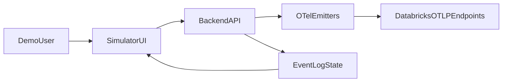

# Build OTel Simulator App (Local First)

## Goal

Create a local web app that visually matches your reference style and emits real OTEL telemetry to Databricks UC tables when users click simulation buttons.

## Architecture

## Files To Add

- [app/frontend/index.html](/Users/robert.leach/dev/vibe/jnj-otel-quick-app/app/frontend/index.html)
- [app/frontend/styles.css](/Users/robert.leach/dev/vibe/jnj-otel-quick-app/app/frontend/styles.css)
- [app/frontend/app.js](/Users/robert.leach/dev/vibe/jnj-otel-quick-app/app/frontend/app.js)
- [app/backend/server.py](/Users/robert.leach/dev/vibe/jnj-otel-quick-app/app/backend/server.py)
- [app/backend/emitter.py](/Users/robert.leach/dev/vibe/jnj-otel-quick-app/app/backend/emitter.py)
- [app/backend/models.py](/Users/robert.leach/dev/vibe/jnj-otel-quick-app/app/backend/models.py)
- [app/backend/**init**.py](/Users/robert.leach/dev/vibe/jnj-otel-quick-app/app/backend/__init__.py)
- [app/README.md](/Users/robert.leach/dev/vibe/jnj-otel-quick-app/app/README.md)

## Reuse From Existing Work

- Reuse env contract already established in [.env](/Users/robert.leach/dev/vibe/jnj-otel-quick-app/.env): host/token/catalog/schema/service + target table names.
- Reuse emitter setup patterns from [notebooks/simple_otel_emitter.ipynb](/Users/robert.leach/dev/vibe/jnj-otel-quick-app/notebooks/simple_otel_emitter.ipynb):
  - fixed endpoints (`/api/2.0/tracing/otel/v1/traces`, `/api/2.0/tracing/otel/v1/logs`, `/api/2.0/otel/v1/metrics`)
  - required Databricks headers (`Authorization`, `X-Databricks-Workspace-Url`, `X-Databricks-UC-Table-Name`)

## UI/UX Plan (Based On Your Screenshot)

- Dark theme with 3 primary domain columns:
  - Infrastructure
  - Networking
  - Applications
- Right-side live event log panel.
- Button cards under each domain to trigger specific scenarios/events.
- Add executive-friendly expanders in each domain section:
  - `What this means` (plain-English business impact)
  - `What telemetry is emitted` (trace/log/metric summary)
  - `How to interpret in dashboards` (simple KPI guidance)

## Simulation Behavior

- Each button sends a POST to backend `/emit/{domain}/{event}`.
- Backend maps event definitions to telemetry payloads:
  - **Traces**: request/operation flow with optional span events
  - **Logs**: success/warn/error notes
  - **Metrics**: counters/histograms for latency, errors, throughput
- Backend returns a concise event result object for immediate UI log rendering.

## Initial Event Catalog

- **Infrastructure**: pod lifecycle, node pressure, deployment rollout, autoscaler
- **Networking**: flow log, subnet latency spike, packet loss, DNS failure
- **Applications**: API request, API error, timeout, frontend exception

## Local Run Workflow

- Start backend service (FastAPI + uvicorn) from `app/backend`.
- Serve frontend as static files from backend for one-command run.
- Validate by clicking one event per domain and checking:
  - UI event log updates
  - backend success response
  - new rows in UC telemetry tables via your existing verification approach

## Acceptance Criteria

- UI visually aligned with reference style (structure, spacing, dark-card hierarchy).
- No secrets exposed client-side (PAT remains backend-only).
- Domain buttons emit real OTEL traces/logs/metrics to configured UC tables.
- Expanders provide plain-English narrative suitable for director-level demo.
- App runs locally with documented setup and command(s).

